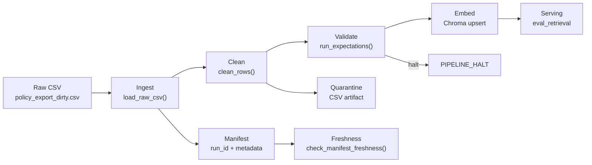

# Kiến trúc pipeline — Lab Day 10

**Nhóm:** C401-C3  
**Cập nhật:** 2026-04-15

---

## 1. Sơ đồ luồng

> Điểm đo **freshness**: `manifest.json` → `latest_exported_at`.  
> **run_id** ghi trong: log file + manifest + Chroma metadata.  
> **quarantine**: `artifacts/quarantine/quarantine_<run_id>.csv`.

---

## 2. Ranh giới trách nhiệm

| Thành phần | Input | Output | Owner nhóm |
|------------|-------|--------|------------|
| Ingest | `data/raw/policy_export_dirty.csv` | `rows[]` in-memory + `raw_records` log | Nghĩa |
| Transform | `rows[]` | `cleaned[]` + `quarantine[]` → CSV artifacts | Đạt |
| Quality | `cleaned[]` | `ExpectationResult[]` + halt/pass decision | Đạt |
| Embed | `cleaned CSV` | Chroma `day10_kb` collection (upsert + prune) | Vinh |
| Monitor | `manifest.json` | PASS/WARN/FAIL freshness + runbook | Minh |

---

## 3. Idempotency & rerun

- Strategy: **upsert** theo `chunk_id` (SHA256 hash ổn định từ `doc_id|chunk_text|seq`)
- Rerun 2 lần: collection count KHÔNG đổi (verified Sprint 2 — count=6 cả 2 lần)
- Prune: sau mỗi publish, xóa vector id cũ không còn trong cleaned run hiện tại → `embed_prune_removed=N` trong log
- Log: `embed_upsert count=6 collection=day10_kb`

---

## 4. Liên hệ Day 09

Pipeline Day 10 feed collection `day10_kb` riêng (tách khỏi Day 09).
- Có thể tích hợp: đổi `CHROMA_COLLECTION` trong `.env` hoặc merge collection để multi-agent Day 09 query cùng knowledge base
- Knowledge base: dùng chung 5 docs (`data/docs/`) kế thừa từ Day 09 (policy_refund_v4, sla_p1_2026, it_helpdesk_faq, hr_leave_policy, access_control_sop)

---

## 5. Rủi ro đã biết

- Freshness FAIL trên CSV mẫu (`exported_at=2026-04-10`) — expected behavior, data cũ 5 ngày so với SLA 24h
- Chưa có CDC real-time cho database changes — pipeline chỉ xử lý batch CSV
- Embedding model `all-MiniLM-L6-v2` chưa tối ưu cho tiếng Việt dài — có thể chuyển sang `bkai-foundation-models/vietnamese-bi-encoder`
- BOM/encoding chỉ xử lý ở text level, chưa validate ở binary level trước khi CSV parse
- Rule versioning HR hard-code ngày `2026-01-01` — nên tham chiếu từ `contracts/data_contract.yaml`
