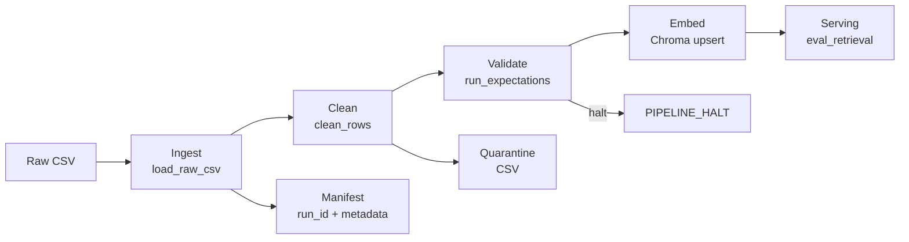

# 📋 Kế Hoạch Cá Nhân — Minh (Monitoring / Docs Owner)

## Lab Day 10 — Data Pipeline & Data Observability

**Vai trò:** Monitoring & Docs Owner  
**Nhánh Git:** `feature/monitoring`  
**File chịu trách nhiệm chính:**
- `monitoring/freshness_check.py` — mở rộng (nếu cần)
- `docs/pipeline_architecture.md` — sơ đồ + bảng ranh giới
- `docs/data_contract.md` — đồng bộ với Nghĩa
- `docs/runbook.md` — 5 mục: Symptom → Prevention
- `reports/group_report.md` — tổng hợp cùng Trung

---

## 🌿 Tạo Nhánh

```bash
git checkout main
git pull origin main
git checkout -b feature/monitoring
```

---

## Sprint 1 (60 phút) — Setup + đọc templates

### Nhiệm vụ cụ thể

#### 1. Setup project (10 phút)
```bash
cd lab
python -m venv .venv
.venv\Scripts\activate
pip install -r requirements.txt
cp .env.example .env
python etl_pipeline.py run --run-id minh-test
```

#### 2. Đọc kỹ `monitoring/freshness_check.py` (15 phút)

**Logic hiện tại:**
- Đọc `manifest.json` → lấy `latest_exported_at` hoặc `run_timestamp`
- Tính `age_hours = (now - exported_at) / 3600`
- So sánh với `sla_hours` (mặc định 24h, configurable qua `.env`)
- Trả về: `PASS` (≤ SLA), `WARN` (thiếu timestamp), `FAIL` (> SLA)

**Lưu ý:** CSV mẫu có `exported_at=2026-04-10T08:00:00` → sẽ FAIL nếu chạy hôm nay vì quá 24h. **Đây là hành vi đúng** — ghi vào runbook.

#### 3. Đọc kỹ 4 template docs (20 phút)
- `docs/pipeline_architecture.md` — cần sơ đồ + bảng 5 thành phần
- `docs/data_contract.md` — Nghĩa đã có source map, cần bổ sung schema + quarantine rules
- `docs/runbook.md` — 5 mục bắt buộc
- `docs/quality_report_template.md` — Đạt sẽ viết, Minh hỗ trợ

#### 4. Bắt đầu draft pipeline_architecture.md (15 phút)
Sơ đồ luồng (Mermaid — sẽ hoàn thiện ở Sprint 4):



### Commit Sprint 1

```bash
git add docs/pipeline_architecture.md
git commit -m "[Sprint 1] monitoring: draft pipeline architecture diagram

- Mermaid flow diagram: raw → ingest → clean → validate → embed → serving
- Branch for quarantine and halt
- TODO: fill responsibility table in Sprint 4"
git push origin feature/monitoring
```

---

## Sprint 2 (60 phút) — Bắt đầu viết docs

### Nhiệm vụ cụ thể

#### 1. Hoàn thiện bảng ranh giới trong pipeline_architecture.md (20 phút)

| Thành phần | Input | Output | Owner nhóm |
|------------|-------|--------|------------|
| Ingest | `data/raw/policy_export_dirty.csv` | `rows[]` (in-memory) + log `raw_records` | Nghĩa |
| Transform | `rows[]` | `cleaned[]` + `quarantine[]` | Đạt |
| Quality | `cleaned[]` | `ExpectationResult[]` + halt/pass | Đạt |
| Embed | `cleaned CSV` | Chroma collection `day10_kb` | Vinh |
| Monitor | `manifest.json` | PASS/WARN/FAIL freshness | Minh |

#### 2. Bổ sung docs/data_contract.md (20 phút)
Đồng bộ với Nghĩa (đã fill source map ở Sprint 1). Bổ sung:
- **Mục 2 — Schema cleaned:** mô tả 5 cột (chunk_id, doc_id, chunk_text, effective_date, exported_at)
- **Mục 3 — Quarantine rules:** doc_id lạ, date invalid, HR cũ, empty content, duplicate
- **Mục 4 — Version canonical:** `policy_refund_v4.txt` = source of truth, version v4

#### 3. Bắt đầu draft runbook.md (20 phút)

**Mục Symptom:**
> Agent trả lời "hoàn tiền trong vòng 14 ngày" thay vì đúng "7 ngày" → user phàn nàn.

**Mục Detection:**
> - `freshness_check.py` trả về FAIL (data > 24h SLA)
> - `expectations.py` E3 (`refund_no_stale_14d_window`) FAIL
> - `eval_retrieval.py` → `q_refund_window`: `hits_forbidden=yes`

### Commit Sprint 2

```bash
git add docs/pipeline_architecture.md docs/data_contract.md docs/runbook.md
git commit -m "[Sprint 2] monitoring: fill architecture table + data contract schema + runbook draft

- pipeline_architecture: responsibility table completed
- data_contract: schema cleaned + quarantine rules + version canonical
- runbook: Symptom + Detection drafted"
git push origin feature/monitoring
```

---

## Sprint 3 (60 phút) — Freshness check + Runbook

### Nhiệm vụ cụ thể

#### 1. Chạy freshness check thực tế (15 phút)
```bash
# Sau khi Trung merge sprint3-clean
python etl_pipeline.py freshness --manifest artifacts/manifests/manifest_sprint3-clean.json
```

**Kết quả kỳ vọng:**
```
FAIL {"latest_exported_at": "2026-04-10T08:00:00", "age_hours": 120.5, "sla_hours": 24.0, "reason": "freshness_sla_exceeded"}
```

> **Giải thích:** FAIL vì CSV mẫu `exported_at=2026-04-10` — đã quá 24h SLA. Đây là evidence quan trọng cho runbook.

#### 2. Hoàn thiện runbook.md — 5 mục đầy đủ (30 phút)

```markdown
## Symptom
Agent trả lời "hoàn tiền trong vòng 14 ngày làm việc" thay vì "7 ngày".
User báo: "chính sách đã đổi rồi mà agent vẫn nói cũ".

## Detection
- `freshness_check`: FAIL — age_hours=120.5 > sla_hours=24.0
- `expectation[refund_no_stale_14d_window]`: FAIL (halt) khi không apply refund fix
- `eval_retrieval.py` → q_refund_window: hits_forbidden=yes

## Diagnosis
| Bước | Việc làm | Kết quả mong đợi |
|------|----------|------------------|
| 1 | Kiểm tra `artifacts/manifests/*.json` | Xem `latest_exported_at` — FAIL nếu quá SLA |
| 2 | Mở `artifacts/quarantine/*.csv` | Xem lý do quarantine — có "stale_hr_policy" không? |
| 3 | Chạy `python eval_retrieval.py` | q_refund_window: hits_forbidden phải = no |

## Mitigation
1. Chạy lại pipeline chuẩn: `python etl_pipeline.py run --run-id hotfix-[date]`
2. Verify: `python eval_retrieval.py --out artifacts/eval/hotfix_eval.csv`
3. Nếu PASS → pipeline đã sửa embedding
4. Nếu vẫn FAIL → kiểm tra raw CSV có cập nhật chưa

## Prevention
- Thêm cron job chạy pipeline mỗi 12h (SLA 24h → 50% buffer)
- Alert khi freshness_check=WARN (50% SLA) trước khi FAIL
- Thêm expectation auto-run trước mỗi embed
- Ghi run_id vào metadata → trace ngược từ agent answer đến pipeline run
```

#### 3. Hỗ trợ team thu thập evidence (15 phút)
- Thu số liệu freshness cho quality report (Đạt)
- Cung cấp runbook context cho group report (Trung)

### Commit Sprint 3

```bash
git add docs/runbook.md
git add docs/pipeline_architecture.md docs/data_contract.md
git commit -m "[Sprint 3] monitoring: complete runbook 5 sections + freshness evidence

- Runbook: Symptom → Detection → Diagnosis → Mitigation → Prevention
- Freshness check: FAIL (age_hours=120.5 > sla=24h) — expected behavior
- Explained SLA strategy: 24h for batch CSV, 50% alert threshold"
git push origin feature/monitoring
```

---

## Sprint 4 (60 phút) — ⭐ Sprint CHÍNH của Minh: Docs + Reports

### Nhiệm vụ cụ thể

#### 1. Hoàn thiện pipeline_architecture.md (15 phút)
Bổ sung các mục còn thiếu:
- **Mục 3 — Idempotency**: upsert theo `chunk_id`, rerun không duplicate, prune id cũ
- **Mục 4 — Liên hệ Day 09**: Pipeline Day 10 feed collection `day10_kb` → có thể tích hợp với RAG Day 08/09 bằng cách point retrieval tới cùng Chroma DB
- **Mục 5 — Rủi ro đã biết**: freshness FAIL trên batch CSV, thiếu CDC real-time, embedding model chưa tối ưu cho tiếng Việt

#### 2. Review + polish 3 docs (10 phút)
Kiểm tra:
- [ ] `pipeline_architecture.md`: có sơ đồ + bảng 5 thành phần + 5 mục
- [ ] `data_contract.md`: source map ≥2 nguồn + schema + quarantine + version
- [ ] `runbook.md`: 5 mục Symptom → Prevention, có bước cụ thể

#### 3. Đóng góp vào group_report.md (15 phút)
Viết phần:
- **Mục 4** (100-150 từ): Freshness & monitoring
  - SLA chọn: 24h (phù hợp batch CSV export hàng ngày)
  - Kết quả: FAIL (age=120.5h) — đúng vì CSV mẫu exported 5 ngày trước
  - PASS khi: chạy pipeline ngay sau export mới → age < 24h
- **Mục 5** (50-100 từ): Liên hệ Day 09
  - Pipeline feed `day10_kb` collection riêng
  - Có thể tích hợp bằng cách đổi `CHROMA_COLLECTION` hoặc merge collection

#### 4. Viết individual report `reports/individual/Minh.md` (20 phút)
- **Mục 1** (80-120 từ): Monitoring & Docs Owner — `freshness_check.py`, 3 docs, group report
- **Mục 2** (100-150 từ): Quyết định KT — SLA 24h cho batch vs 4h cho real-time; boundary đo: `exported_at` trong manifest (publish boundary) vs `run_timestamp` (ingest boundary)
- **Mục 3** (100-150 từ): Anomaly — freshness FAIL trên CSV mẫu; giải thích tại sao FAIL là hành vi đúng (data cũ 5 ngày)
- **Mục 4** (80-120 từ): Dán output freshness_check trước (FAIL) vs sau khi cập nhật timestamp (PASS/WARN)
- **Mục 5** (40-80 từ): Cải tiến — đo freshness ở 2 boundary (ingest + publish), tự động alert qua Slack

### Commit Sprint 4

```bash
git add docs/pipeline_architecture.md docs/data_contract.md docs/runbook.md
git add reports/individual/Minh.md
git commit -m "[Sprint 4] monitoring: finalize all docs + individual report

- pipeline_architecture.md: complete with Mermaid diagram, table, idempotency
- data_contract.md: schema + quarantine + version canonical
- runbook.md: 5 sections fully written
- Minh individual report: 400-650 words, freshness evidence"
git push origin feature/monitoring
```

> **Sau đó:** Báo Trung để merge lần cuối vào main.

---

## ✅ Checklist deliverables của Minh

| Deliverable | Sprint | Trạng thái |
|---|---|---|
| Đọc hiểu `freshness_check.py` | 1 | ☐ |
| Draft `docs/pipeline_architecture.md` (sơ đồ) | 1 | ☐ |
| Bảng ranh giới trong `pipeline_architecture.md` | 2 | ☐ |
| Bổ sung `docs/data_contract.md` (schema + quarantine) | 2 | ☐ |
| Draft `docs/runbook.md` (Symptom + Detection) | 2 | ☐ |
| Chạy freshness check + thu evidence | 3 | ☐ |
| Hoàn thiện `docs/runbook.md` (5 mục đầy đủ) | 3 | ☐ |
| Finalize 3 docs (architecture, contract, runbook) | 4 | ☐ |
| Đóng góp group report (mục 4 + mục 5) | 4 | ☐ |
| `reports/individual/Minh.md` (400-650 từ) | 4 | ☐ |
